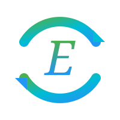

# Strainnovation S.r.l. - Official Website


Advanced Materials for Space & Sustainability - Professional website for Strainnovation S.r.l., a spin-off of the University of Rome Tor Vergata.

## 🚀 Features

### Premium Design
- **Modern UI/UX**: Cutting-edge design with glassmorphism and neumorphism effects
- **Dark/Light Theme**: Seamless theme switching with persistent preferences
- **Bilingual Support**: Full EN/IT language switching
- **Responsive Design**: Optimized for all devices (320px to 4K)

### Advanced Animations
- **GSAP Powered**: Professional-grade animations with ScrollTrigger
- **Three.js Background**: Interactive 3D particle network in hero section
- **Smooth Scroll**: Butter-smooth scroll behavior
- **Micro-interactions**: Hover effects, magnetic cards, ripple effects

### Accessibility & Performance
- **WCAG AA Compliant**: Semantic HTML, ARIA labels, keyboard navigation
- **Lighthouse 90+**: Optimized for performance, accessibility, and SEO
- **Progressive Enhancement**: Works without JavaScript (core functionality)
- **Lazy Loading**: Optimized resource loading

## 📁 Project Structure

```
/
├── index.html                 # Main single-page application
├── privacy-policy.html        # GDPR-compliant privacy policy
├── legal-notes.html          # Legal information and terms
├── README.md                 # Project documentation
├── css/
│   ├── main.css             # Core styles and design system
│   └── animations.css       # Animation definitions
├── js/
│   ├── main.js              # Core functionality (language, theme, interactions)
│   ├── animations.js        # GSAP animations and scroll triggers
│   └── three-bg.js          # Three.js 3D background
└── assets/
    ├── images/              # Image assets (logos, team photos)
    └── icons/               # SVG icons and favicon
```

## 🛠️ Tech Stack

### Core Technologies
- **HTML5**: Semantic markup
- **CSS3**: Custom properties, Grid, Flexbox
- **JavaScript (ES6+)**: Vanilla JS (no frameworks)

### Libraries (CDN)
- **GSAP 3.12.5**: Animation library
- **ScrollTrigger**: Scroll-based animations
- **Three.js r128**: 3D graphics

### Fonts
- **Space Grotesk**: Headings (tech aesthetic)
- **Inter**: Body text (excellent readability)
- **JetBrains Mono**: Technical specifications

## 🎨 Design System

### Color Palette
```css
--primary-blue: #0A1F44      /* Deep space blue */
--accent-blue: #1E88E5       /* Vibrant tech blue */
--primary-green: #00C853     /* Sustainability green */
--accent-orange: #FF6F00     /* Innovation accent */
--dark-bg: #0D1117           /* Rich dark background */
--light-bg: #F5F7FA          /* Clean light background */
```

### Typography
- Headings: Space Grotesk (400-700)
- Body: Inter (300-700)
- Monospace: JetBrains Mono (400-500)

### Breakpoints
- Mobile: 320px - 767px
- Tablet: 768px - 1023px
- Desktop: 1024px - 1439px
- Large Desktop: 1440px+

## 🚀 Getting Started

### Prerequisites
- Modern web browser (Chrome 90+, Firefox 88+, Safari 14+, Edge 90+)
- Web server (for local development)

### Installation

1. **Clone or download the repository**
```bash
# No build process required - static HTML/CSS/JS
```

2. **Serve the files**

Using Python:
```bash
python -m http.server 8000
```

Using Node.js (http-server):
```bash
npx http-server -p 8000
```

Using PHP:
```bash
php -S localhost:8000
```

3. **Open in browser**
```
http://localhost:8000
```

### No Build Required
This is a static website with no build process. All assets are loaded via CDN or included directly.

## 📝 Customization Guide

### Changing Colors

Edit `css/main.css` CSS custom properties:

```css
:root {
    --primary-blue: #YOUR_COLOR;
    --accent-blue: #YOUR_COLOR;
    /* etc. */
}
```

### Adding Team Members

In `index.html`, add a new `.team-card` in the `.team-track` section:

```html
<div class="team-card">
    <div class="team-avatar">
        <!-- Add avatar SVG or image -->
    </div>
    <h3>Name</h3>
    <h4 data-en="Role EN" data-it="Role IT">Role</h4>
    <p data-en="Bio EN" data-it="Bio IT">Bio</p>
    <a href="#" class="linkedin-link"><!-- LinkedIn icon --></a>
</div>
```

### Updating Content

All bilingual content uses `data-en` and `data-it` attributes:

```html
<p data-en="English text" data-it="Testo italiano">English text</p>
```

The language switcher automatically updates all elements.

### Modifying Animations

Edit `js/animations.js` to customize GSAP animations:

```javascript
gsap.from('.your-element', {
    y: 100,
    opacity: 0,
    duration: 1,
    ease: 'power2.out'
});
```

## 🎯 Key Sections

### 1. Hero Section
- 3D animated background (Three.js)
- Typewriter effect title
- Call-to-action buttons
- Scroll indicator

### 2. Mission Section
- Bento grid layout
- Animated statistics
- Progress bars
- Icon animations

### 3. Technologies Section
- Split-screen layout
- Parallax effects
- Technical specifications
- Feature lists

### 4. Services Section
- Card grid with flip effects
- Magnetic hover interactions
- Expandable content

### 5. Team Section
- Horizontal carousel
- Gradient avatars
- LinkedIn integration

### 6. Contact Section
- Validated contact form
- Real-time validation
- Company information
- Form submission handling

## 📱 Browser Support

- ✅ Chrome 90+
- ✅ Firefox 88+
- ✅ Safari 14+
- ✅ Edge 90+
- ✅ Opera 76+

## ⚡ Performance Optimizations

### Implemented
- Lazy loading for images
- Debounced resize handlers
- RequestAnimationFrame for smooth animations
- CSS containment for layout optimization
- Preconnect for font loading
- GPU-accelerated animations (translateZ)

### Best Practices
- Minify CSS/JS for production
- Enable Gzip/Brotli compression
- Use WebP images with JPEG fallback
- Implement CDN for static assets
- Add service worker for offline support (optional)

## 🔒 Security Features

- HTTPS ready
- No inline scripts (CSP friendly)
- XSS protection in form handling
- Input validation and sanitization
- GDPR-compliant privacy policy
- Secure external links (rel="noopener")

## 🌐 SEO Optimization

- Semantic HTML5 structure
- Meta descriptions and keywords
- Open Graph tags ready
- Sitemap ready (add sitemap.xml)
- Robots.txt ready
- Alt text for all images
- Clean URL structure

## 📧 Contact Form Integration

The contact form includes client-side validation. For production, integrate with a backend:

### Option 1: FormSpree
```javascript
// In js/main.js, update the form submission
const response = await fetch('https://formspree.io/f/YOUR_FORM_ID', {
    method: 'POST',
    body: formData,
    headers: { 'Accept': 'application/json' }
});
```

### Option 2: Custom Backend
```javascript
// In js/main.js, update the form submission
const response = await fetch('/api/contact', {
    method: 'POST',
    body: JSON.stringify(Object.fromEntries(formData)),
    headers: { 'Content-Type': 'application/json' }
});
```

### Option 3: Mailto Link
Current implementation uses a placeholder. Update to:
```html
<form action="mailto:info@strain.it" method="post" enctype="text/plain">
```

## 🎨 Assets & Branding

### Logo
Replace the SVG logo in `index.html` header with your actual logo:
```html
<a href="#home" class="logo">
    
    <span>STRAIN</span>
</a>
```

### Team Photos
Add team member photos to `assets/images/team/`:
- Recommended size: 400x400px
- Format: WebP with JPEG fallback
- Optimize for web (compress)

### Favicon
Create and add favicon files to `assets/icons/`:
```html
<link rel="icon" type="image/png" sizes="32x32" href="assets/icons/favicon-32x32.png">
<link rel="icon" type="image/png" sizes="16x16" href="assets/icons/favicon-16x16.png">
<link rel="apple-touch-icon" sizes="180x180" href="assets/icons/apple-touch-icon.png">
```

## 🚀 Deployment

### Static Hosting Options

#### Netlify
1. Connect Git repository
2. Build command: (none)
3. Publish directory: `/`
4. Deploy!

#### Vercel
```bash
vercel --prod
```

#### GitHub Pages
1. Push to GitHub repository
2. Settings → Pages
3. Source: main branch
4. Root directory

#### Traditional Hosting
Upload all files via FTP/SFTP to your web server's public directory.

### Environment Configuration
No environment variables needed. All configuration is in the code.

### HTTPS
Ensure HTTPS is enabled for:
- Secure form submissions
- Geolocation API (Three.js)
- Service workers (if added)

## 📊 Analytics Integration

Add your analytics code before the closing `</body>` tag in `index.html`:

### Google Analytics
```html
<!-- Google Analytics -->
<script async src="https://www.googletagmanager.com/gtag/js?id=GA_MEASUREMENT_ID"></script>
<script>
    window.dataLayer = window.dataLayer || [];
    function gtag(){dataLayer.push(arguments);}
    gtag('js', new Date());
    gtag('config', 'GA_MEASUREMENT_ID');
</script>
```

## 🐛 Troubleshooting

### Issue: Three.js background not loading
- Check browser console for errors
- Ensure Three.js CDN is accessible
- Verify WebGL support in browser

### Issue: Animations not working
- Check GSAP CDN is loaded
- Verify ScrollTrigger plugin is registered
- Check browser console for JavaScript errors

### Issue: Language switching not working
- Verify all text has `data-en` and `data-it` attributes
- Check localStorage is enabled
- Clear browser cache

### Issue: Form validation issues
- Check email regex pattern
- Verify required fields have `required` attribute
- Test in different browsers

## 📞 Support

For technical support or questions:
- **Email**: info@strain.it
- **PEC**: pec@strain.it
- **University**: Università di Roma Tor Vergata - STEP

## 📄 License

© 2024 Strainnovation S.r.l. All rights reserved.

This website and its contents are proprietary to Strainnovation S.r.l. Unauthorized reproduction or distribution is prohibited.

## 🙏 Credits

### Technologies
- GSAP by GreenSock
- Three.js by Mr.doob and contributors
- Google Fonts

### Design
- Designed and developed for Strainnovation S.r.l.
- Spin-off of Università di Roma Tor Vergata

## 🔄 Version History

### v1.0.0 (November 2024)
- Initial release
- Bilingual support (EN/IT)
- Dark/Light theme
- 3D animated background
- GSAP scroll animations
- Fully responsive design
- GDPR-compliant
- Accessibility optimized

---

**Built with ❤️ for Advanced Aerospace Materials and Sustainability**

🚀 Strainnovation S.r.l. - Shaping the Future of Space Technology
